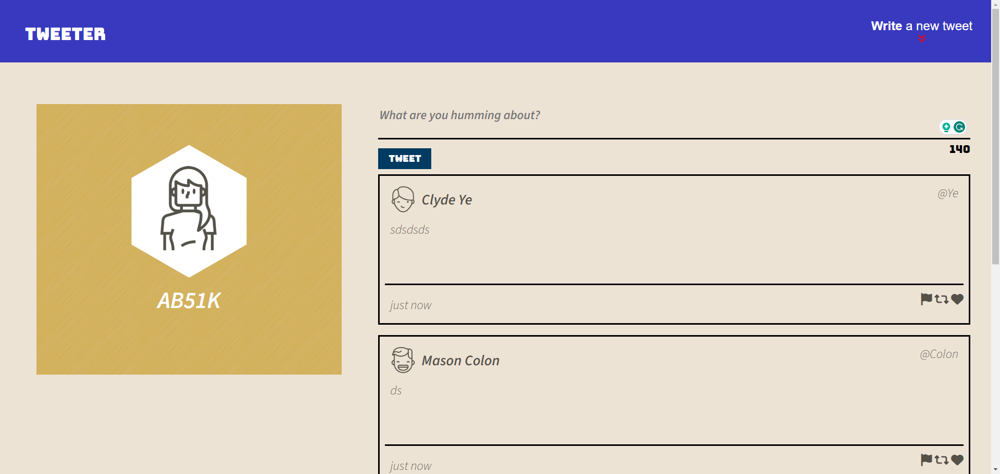
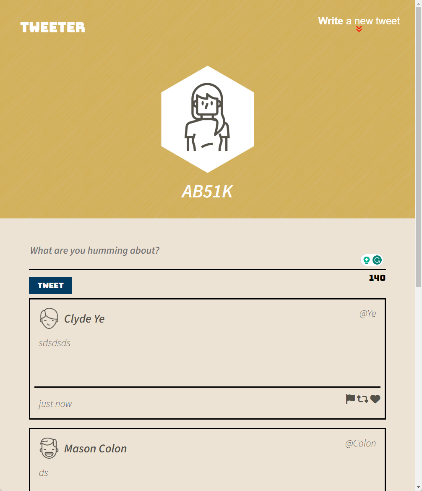

### Tweeter Project

Tweeter is a simple, single-page Twitter clone that allows users to post short messages.

This repository serves as the starter code for the project. Students will fork and clone this repository, then build upon it to practice their HTML, CSS, JS, jQuery, and AJAX front-end skills, as well as their Node.js and Express.js back-end skills.

### Getting Started

1. [Create](https://docs.github.com/en/repositories/creating-and-managing-repositories/creating-a-repository-from-a-template) a new repository using this repository as a template.
2. Clone your repository onto your local device.
3. Install dependencies using the `npm install` command.
4. Start the web server using the `npm run local` command. The app will be served at <http://localhost:8080/>.
5. Visit <http://localhost:8080/> in your browser.

### Dependencies

- **body-parser** (`^1.15.2`): Middleware to parse the HTTP request body.
- **chance** (`^1.0.2`): Library for generating random data.
- **express** (`^4.13.4`): Web application framework for Node.js.
- **md5** (`^2.1.0`): Library for generating MD5 hashes.

## Screenshots
#### DeskTop view:

#### Mobile View

### Functional Requirements

**Client-side Single Page App (SPA)**:

- Communicates with a server via AJAX.

**Display Requirements**:

**Navigation Bar**:

- Fixed to the top.
- Contains padding on both sides.
- Contains a "Compose" button.

**Compose Tweet Box**:

- Displayed above the list of tweets.
- Contains a form for submitting tweets, including a textarea for new tweet content and a submit button.
- Contains a Character Counter that shows the remaining characters (starts at 140).

**List of Tweets**:

- Displays tweets in reverse-chronological order (by creation time descending).

**Individual Tweets**:

- Display a box shadow on hover.

**Action Icons**:

- Change color on hover.

**Character Counter**:

- Updates to show remaining characters when typing.
- Turns red when exceeding 140 characters.

**Compose Tweet**:

- Displays an error message for invalid tweets.
- Clears the textarea and resets the Character Counter after a valid tweet is submitted.

### Stretch Goals

**Navigation Bar**:

- Toggle visibility and focus on the Compose Tweet box when the "Compose" button is clicked.

### Contributing

Contributions are welcome! Feel free to fork this repository and submit a pull request.

### License

This project is licensed under the [MIT License](LICENSE).
